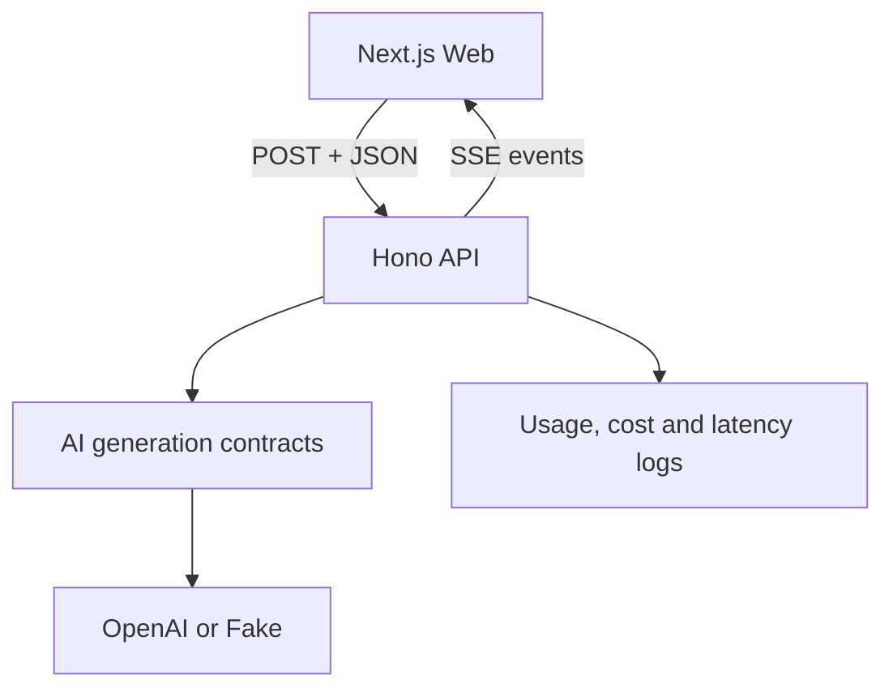

# Architecture

## Scope

This document describes the current ChangePilot architecture as the Code
Intelligence milestone begins, after completion of the LLM Engineering
Foundations milestone.

It documents what exists today. Planned capabilities such as repository
ingestion, embeddings, RAG, MCP and agents belong to the roadmap and are not
represented as current components.

## System overview



ChangePilot is organized as a pnpm and Turborepo monorepo.

The current runtime consists of:

- a Next.js web application
- a Hono API
- an independent AI package
- an OpenAI provider implementation
- a deterministic Fake provider implementation

The monorepo also contains an early `code-intelligence` package. It is not part
of the current runtime or the web/API flow shown above.

## Web application

Location:

```text
apps/web
```

The web application is responsible for:

- collecting a change description
- starting a review request
- consuming the streaming HTTP response
- parsing SSE frames
- rendering text incrementally
- representing generation state
- handling completed, incomplete, cancelled and failed generations
- propagating user cancellation
- measuring client-perceived latency

The frontend sends:

```http
POST /reviews/stream
Content-Type: application/json
```

with:

```json
{
  "changeDescription": "Description of the software change."
}
```

The frontend does not:

- instantiate provider SDKs
- know OpenAI request or response types
- implement provider retry
- calculate provider pricing
- map provider errors
- receive OpenAI stream events directly

### Client generation state

The frontend models the following states:

- `idle`
- `streaming`
- `completed`
- `cancelled`
- `error`

A `finished` event only produces the `completed` state when its finish reason is
`completed`.

The following finish reasons preserve partial output but result in an error
state:

- `max-output-tokens`
- `content-filter`

### Client latency

The frontend measures:

- time to first token
- time to last token
- total client-perceived duration

The resulting record is currently emitted as a structured `ui.latency` console
log.

## API application

Location:

```text
apps/api
```

The Hono API is the backend entry point and application composition root.

It is responsible for:

- validating the HTTP request
- constructing the current review generation request
- selecting the configured AI provider
- injecting the adapter and pricing into the application
- starting and consuming the domain generation stream
- translating domain events into SSE
- combining timeout and disconnection cancellation signals
- calculating usage, estimated cost and server latency
- mapping internal errors to safe public errors
- emitting structured operational logs

The API depends on the public surface of `@changepilot/ai`.

### Composition root

Provider composition is implemented in:

```text
apps/api/src/providers/review-provider.ts
```

The selected provider is controlled by:

```env
AI_PROVIDER=openai
```

or:

```env
AI_PROVIDER=fake
```

The composition result contains:

```ts
type ReviewProvider = Readonly<{
  id: "openai" | "fake";
  adapter: StreamingGenerationAdapter;
  pricing: ModelPricing;
}>;
```

The route depends on `StreamingGenerationAdapter` and `ModelPricing`, not on a
specific provider implementation.

### Application creation

The Hono application is created by:

```ts
createApp(adapter, pricing, options);
```

Its dependencies are passed explicitly so that:

- production can provide the configured provider
- tests can provide deterministic adapters
- tests can provide a fake monotonic clock
- timeout behavior can be configured

## AI package

Location:

```text
packages/ai
```

The AI package owns the low-level foundations used to communicate with LLM
providers without exposing provider types to the rest of the product.

Its internal organization is:

```text
packages/ai/src/
├── generation/
├── labs/
├── observability/
├── providers/
│   ├── fake/
│   └── openai/
├── reviews/
├── testing/
└── usage/
```

## Generation domain

Location:

```text
packages/ai/src/generation
```

This directory contains the stable provider-neutral contracts and runtime
primitives.

It includes:

- `GenerationRequest`
- `GenerationResponse`
- `TokenUsage`
- `FinishReason`
- `GenerationAdapter`
- `StreamingGenerationAdapter`
- `StructuredGenerationAdapter`
- tool-calling contracts
- generation messages
- generation parameters
- normalized generation errors
- retry policy and calculations

The generation domain does not depend on OpenAI SDK types.

### Generation messages

Conversation messages represent application intent through provider-neutral
roles:

- instruction
- user
- assistant
- tool

Provider adapters are responsible for translating these roles to a provider
representation.

### Generation parameters

Generation parameters represent the subset of controls currently needed by the
application:

- temperature or top-p sampling
- maximum output tokens
- stop sequences

Provider adapters map them to the corresponding provider fields.

### Generation responses

A generation response contains:

- response ID
- model
- output text
- finish reason
- token usage

Supported finish reasons are:

- `completed`
- `max-output-tokens`
- `content-filter`

## Provider adapters

Location:

```text
packages/ai/src/providers
```

Providers implement ChangePilot generation contracts and isolate external SDK
representations.

### OpenAI provider

The OpenAI implementation is responsible for:

- mapping domain requests to the Responses API
- enabling provider streaming
- mapping Responses API events to domain events
- mapping provider response statuses
- mapping token usage
- translating SDK and HTTP failures to `GenerationError`
- applying application-controlled retry
- forwarding cancellation signals

OpenAI SDK types remain inside the OpenAI provider boundary.

The OpenAI SDK is created with its internal retry disabled:

```ts
maxRetries: 0;
```

This ensures that retry behavior is controlled and observed by the ChangePilot
adapter instead of being duplicated between the SDK and application.

### Fake provider

The Fake provider is a deterministic implementation of
`StreamingGenerationAdapter`.

It:

- emits configured text chunks
- concatenates chunks into final output
- emits one `finished` event
- uses zero token usage
- uses zero model pricing
- respects cancellation
- requires no credentials or network access

It supports:

- local development
- API development without provider costs
- deterministic tests
- contract verification

### Capability boundaries

Streaming, structured generation and tool calling are modeled as separate
capabilities.

ChangePilot deliberately avoids one universal provider interface containing
every possible AI capability.

This prevents the abstraction from becoming a lowest-common-denominator model
of different providers.

## Reviews

Location:

```text
packages/ai/src/reviews
```

This directory currently contains review-specific AI primitives developed
during the foundations milestone, including:

- the `ChangeReview` Zod schema
- a local change-evidence tool used by tool-calling experiments

Structured review generation and tool calling exist in the AI package, but the
current web and API review flow uses streaming text generation.

The user currently provides the change description manually.

## Labs

Location:

```text
packages/ai/src/labs
```

Labs contain educational implementations that demonstrate AI Engineering
concepts but are not automatically part of the production path.

Current examples include:

- token sequence experiments
- context window calculations
- generation lifecycle modeling
- context selection
- review prompt construction

A primitive should leave `labs` when it becomes a stable dependency of the
product.

Generation parameters and message sequences were moved into `generation`
because they are used by runtime contracts, adapters, API composition, runners
and tests.

## Code Intelligence package

Location:

```text
packages/code-intelligence
```

This package is the future boundary for primitives that help ChangePilot
understand software repositories, such as representation, retrieval and
repository-aware search.

At this stage it contains:

- an educational literal-search lab that performs case-insensitive substring
  matching and intentionally demonstrates the gap between textual matching and
  semantic relevance
- a provider-independent `EmbeddingVector` primitive that preserves component
  order, derives dimensionality from the component count and accepts only
  finite numeric components
- pure dot product, Euclidean distance and cosine similarity operations that
  require equal vector dimensionality
- an exact in-memory vector search that uses cosine similarity for its first
  descending ranking and preserves input order for tied scores
- a minimal `RepositoryDocument` representation containing only a repository
  path and its exact textual content
- recursive discovery of regular repository files using relative, portable and
  globally sorted paths while ignoring symbolic links

Embedding vectors defensively copy their input values, so their dimensions and
components are isolated from later mutations to the original array.

The package currently has:

- no embedding model
- no embedding provider
- no real embedding generation
- no persistence or vector database
- no semantic search backed by model-produced embeddings
- no `.gitignore` or other ignore rules during file discovery
- no reading of discovered file contents
- no binary-file detection
- no file-size limit
- no complete repository-ingestion pipeline
- no runtime consumer

It is intentionally absent from the web/API runtime diagram because no
application flow depends on it yet.

## Review streaming lifecycle

The current review lifecycle is:

1. The user submits a change description.
2. The web application creates an `AbortController`.
3. The web application sends `POST /reviews/stream`.
4. The API validates `changeDescription`.
5. The API creates a provider-neutral `GenerationRequest`.
6. The API combines disconnect and timeout signals.
7. The selected adapter maps the request to its provider representation.
8. The provider emits incremental events.
9. The adapter translates provider events into domain events.
10. The API records usage, cost and latency when it receives `finished`.
11. The API serializes domain events as SSE.
12. The frontend parses and reduces the events into interface state.

## Streaming protocol

The API returns:

```http
Content-Type: text/event-stream
```

The domain-to-wire event types are:

### Text delta

```json
{
  "type": "text-delta",
  "delta": "Partial generated text."
}
```

### Finished

```json
{
  "type": "finished",
  "response": {
    "id": "response-id",
    "model": "model-id",
    "outputText": "Complete generated text.",
    "finishReason": "completed",
    "usage": {
      "inputTokens": 100,
      "outputTokens": 50,
      "totalTokens": 150
    }
  }
}
```

### Error

```json
{
  "type": "error",
  "code": "provider-unavailable",
  "message": "The AI provider is temporarily unavailable.",
  "retryable": true
}
```

Provider-specific stream events are never sent to the frontend.

### Why fetch instead of EventSource

The review begins with a POST request containing a JSON body.

Native browser `EventSource` only supports GET requests and does not provide the
request body and cancellation control required by this flow.

The frontend therefore uses:

- `fetch`
- `ReadableStream`
- an SSE frame parser
- `AbortController`

## Cancellation and timeout

Cancellation is propagated through the complete stack.

### User cancellation

```text
Browser AbortController
→ HTTP request cancellation
→ Hono stream onAbort
→ API disconnect signal
→ provider signal
```

### Application timeout

The API creates a timeout controller using:

```env
AI_GENERATION_TIMEOUT_MS
```

The disconnect and timeout signals are combined with:

```ts
AbortSignal.any(...)
```

When the timeout expires, the provider operation is aborted and the API emits a
public timeout error when the client connection is still available.

## Errors and retry

Provider and application errors are normalized as `GenerationError`.

Supported error codes include:

- `invalid-request`
- `authentication`
- `permission-denied`
- `rate-limit`
- `quota-exceeded`
- `provider-unavailable`
- `timeout`
- `cancelled`
- `unknown`

Each error declares whether it is retryable.

The OpenAI streaming adapter retries only when:

- the error is classified as retryable
- the retry policy allows another attempt
- the retry budget has not been exhausted
- the request has not been cancelled
- no text delta has been emitted

Retry is not performed after partial text has been emitted because restarting
the request could duplicate output already delivered to the user.

The retry implementation supports:

- exponential backoff
- jitter
- `Retry-After`
- maximum attempts
- total delay budget
- cancellation while waiting

Public SSE errors contain safe application messages rather than raw provider
details.

## Usage and cost

Token usage is read from the terminal provider response and mapped to:

```ts
type TokenUsage = Readonly<{
  inputTokens: number;
  outputTokens: number;
  totalTokens: number;
}>;
```

Estimated cost is calculated using model pricing:

```ts
type ModelPricing = Readonly<{
  inputUsdPerMillionTokens: number;
  outputUsdPerMillionTokens: number;
}>;
```

The calculation produces:

- estimated input cost
- estimated output cost
- estimated total cost

Cost values are estimates based on locally configured pricing. They are not a
replacement for provider billing records.

The Fake provider uses zero pricing.

## Observability

### Server-side records

The API currently emits structured JSON logs for:

- `ai.usage`
- `ai.latency`
- `ai.error`
- `ai.cancelled`

Server latency records include:

- application preparation time
- provider time to first token
- provider time to last token
- provider duration
- total request duration

### Client-side records

The frontend emits:

- `ui.latency`

Client latency represents the time perceived by the browser and includes
boundaries that server measurements do not observe.

### Current observability limitations

Operational records currently use `console` output.

ChangePilot does not yet provide:

- persistent metric storage
- aggregation by period
- dashboards
- alerting
- distributed tracing
- complete correlation across every failure path
- provider billing reconciliation

Complete usage is only available when the provider emits a terminal response
containing usage information.

## Testing

The AI layer uses several test levels.

### Unit tests

Unit tests verify deterministic logic such as:

- request mapping
- response mapping
- schema validation
- usage and cost calculation
- latency calculation
- error classification
- retry decisions
- backoff and jitter
- stream parsing and reducers

### Fake provider tests

The Fake provider verifies:

- deterministic chunks
- final response construction
- cancellation behavior

### Contract tests

The same streaming contract runs against:

- Fake provider
- OpenAI adapter with an injected fake transport

The contract verifies:

- text deltas are emitted
- exactly one final event exists
- the final event is last
- concatenated deltas match final output
- response metadata is valid
- token usage is consistent

### Integration verification

Real OpenAI integration is opt-in and separate from the default test suite.

The default test command does not require network access or provider
credentials.

### Tests versus evals

Tests verify deterministic software and protocol invariants.

Evals will measure probabilistic qualities such as:

- correctness
- relevance
- completeness
- useful severity classification
- hallucination
- review quality

An eval harness is not implemented yet.

## Runtime configuration

### API

| Variable                   |    Required | Description                                             |
| -------------------------- | ----------: | ------------------------------------------------------- |
| `AI_PROVIDER`              |          No | `openai` or `fake`; defaults to `openai`                |
| `OPENAI_API_KEY`           | OpenAI only | OpenAI credential                                       |
| `OPENAI_MODEL`             | OpenAI only | OpenAI model used by the adapter                        |
| `AI_GENERATION_TIMEOUT_MS` |          No | Generation timeout; defaults to `30000`                 |
| `API_PORT`                 |          No | API port; defaults to `3001`                            |
| `WEB_ORIGIN`               |          No | Allowed web origin; defaults to `http://localhost:3000` |

### Web

| Variable              | Required | Description                            |
| --------------------- | -------: | -------------------------------------- |
| `NEXT_PUBLIC_API_URL` |      Yes | Public base URL of the ChangePilot API |

## Dependency rules

The current dependency rules are:

- Web may depend on the public HTTP/SSE API.
- Web must not depend on provider SDKs.
- API may depend on the public `@changepilot/ai` package.
- API routes depend on provider-neutral contracts.
- Provider selection occurs in the API composition root.
- Generation domain code must not depend on provider implementations.
- Providers may depend on generation contracts.
- OpenAI types must remain inside the OpenAI boundary.
- Testing helpers must not be exported as public production API.
- Labs must not become production dependencies accidentally.

## Architecture decisions

Relevant Architecture Decision Records:

- [ADR 0001: Separate Web and API Applications](adr/0001-separate-web-and-api.md)
- [ADR 0002: Provider-Neutral Generation Contracts](adr/0002-provider-neutral-generation-contracts.md)
- [ADR 0003: SSE for Review Streaming](adr/0003-sse-for-review-streaming.md)

## Current limitations

The architecture does not currently include:

- repository ingestion
- GitHub integration
- repository versioning
- embeddings
- semantic search
- vector storage
- RAG
- persistent application data
- authentication
- background workers
- MCP
- autonomous agents
- AI quality evals
- production telemetry infrastructure

These capabilities are tracked in the project roadmap.
